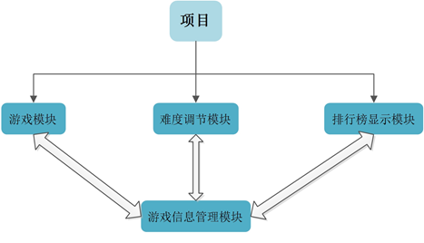
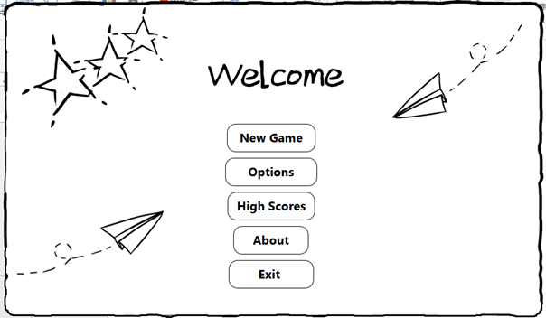
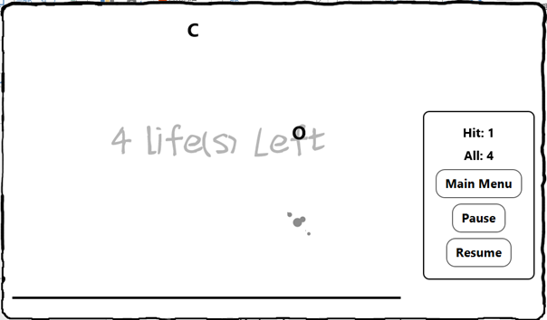
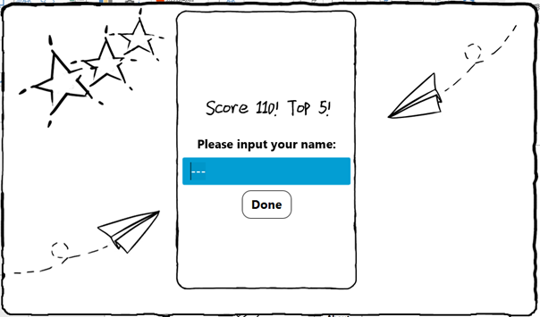
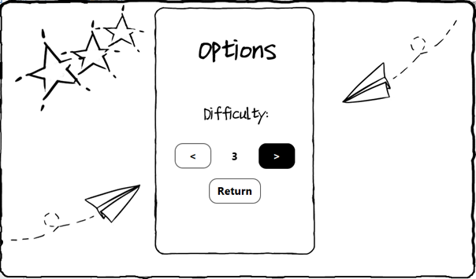
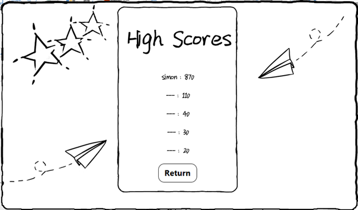

# TypingGame
A Typing Practice Game Using JavaFX

This is a project from my Netbeans projects, a course project for Java.

## Features
- Hand-drawed UI with CSS by using JavaFX

- Leaderboard of 5 top scores

- Random animation after letter hit

## Bug?
Some bugs I already knew but haven't fix:
     In a game, when I clicked the pause button, I still can press keys and the paused letters are able to got hit.
     I really don't know how to delete unused objects in the memory( I treat letters falling down as objects, as Bubble class). So when I change the difficulty to the highest ( 5 specificly) the game will occupy a lot memory as it created a lot bubbles.

## Modules in Chinese

## Demo Pics

